# PES Project: Real-Time Environment Monitor with RTC and DHT11

Using the FRDM-KL25Z microcontroller, this project aims to create a real-time environment monitor with integrated DHT11 sensor data collection for temperature and humidity, real-time clock (RTC) operations, dynamic display on an I2C-enabled LCD, and a command processor for user interaction.

## Tools Used
1) System: Windows 11
2) IDE : MCUxpresso

## Folder Structure
all files are in the source folder.

## Steps for running the project
1. For the RTC setup, connect PC1 to PC3 on the board
2. Connect the DHT11 sensor pins as such:
        +   : to 3V3 on the board
        -   : to GND on the board
        OUT : to PD3 on the board
        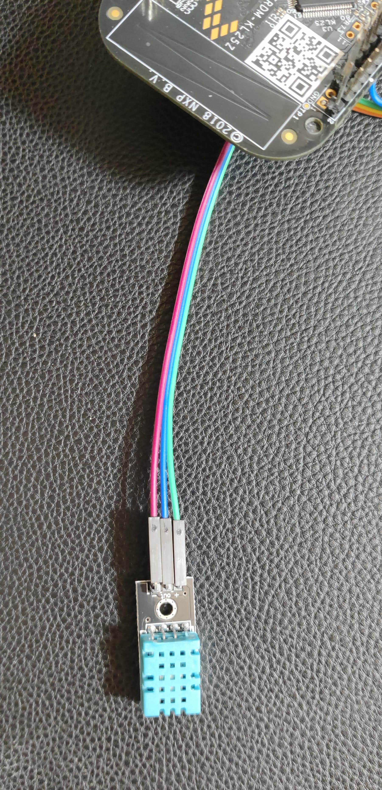
3. Connect the I2C LCD as such:
        VCC : to 5V on the board
        GND : to GND on the board
        SCL : to PB0 on the board 
        SDA : to PB1 on the board 
        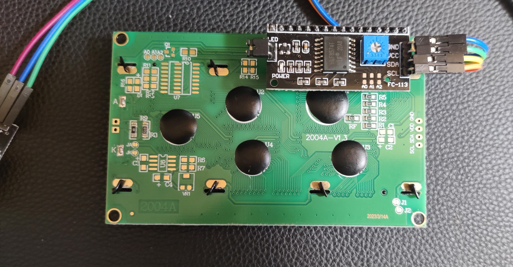
4. The setup
        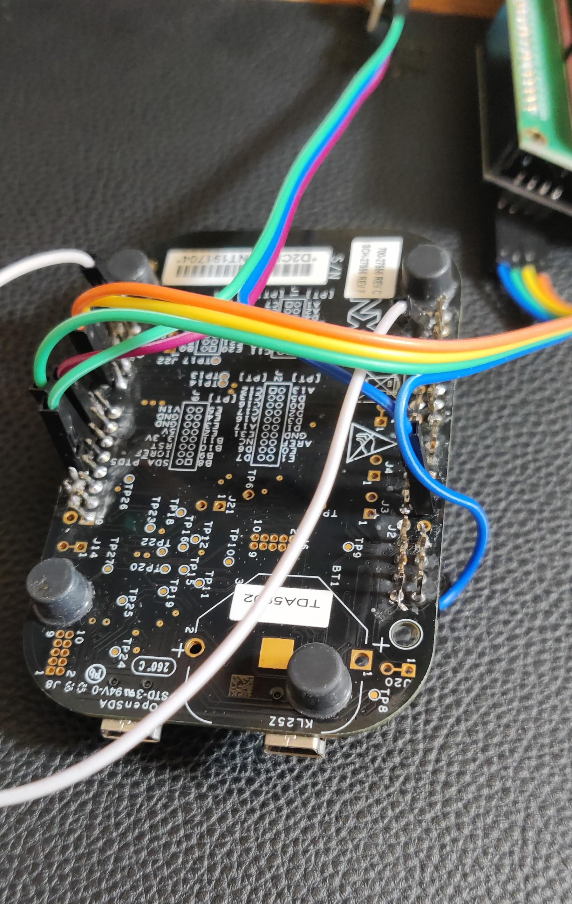
        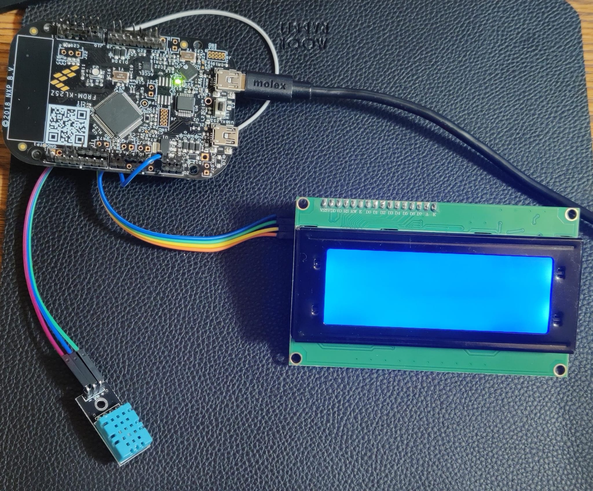
5. Run the project as normal and open TeraTerm or any serial terminal and configure the following parameters:
        Baud rate: 38400
        Data size: 8
        Parity:	Odd
        Stop Bits: 2
        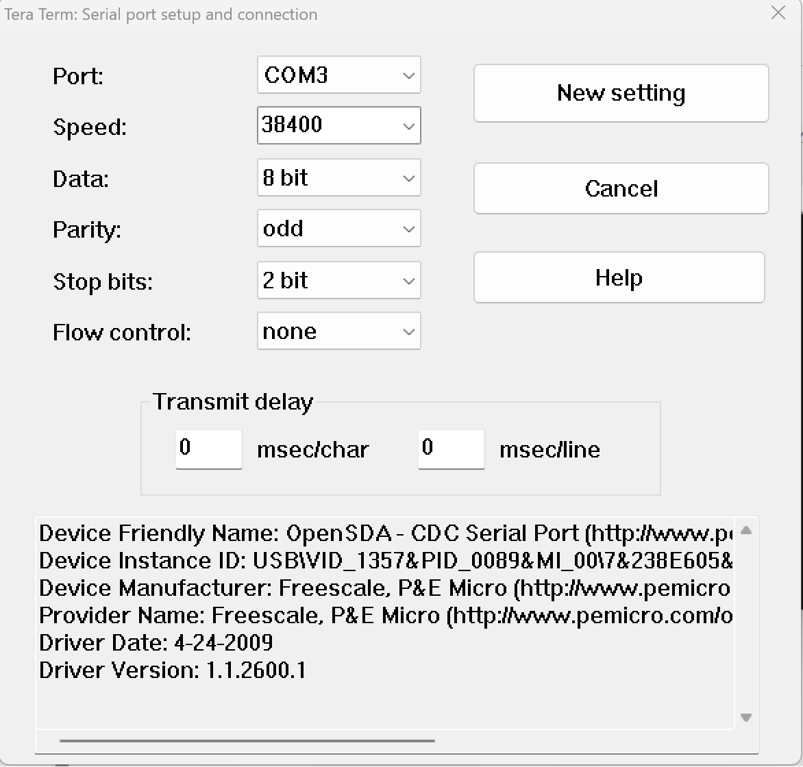
6. The clock should start running immediately on the right hand corner. User can now give inputs via the serial terminal. Type 'help' to see existing commands
        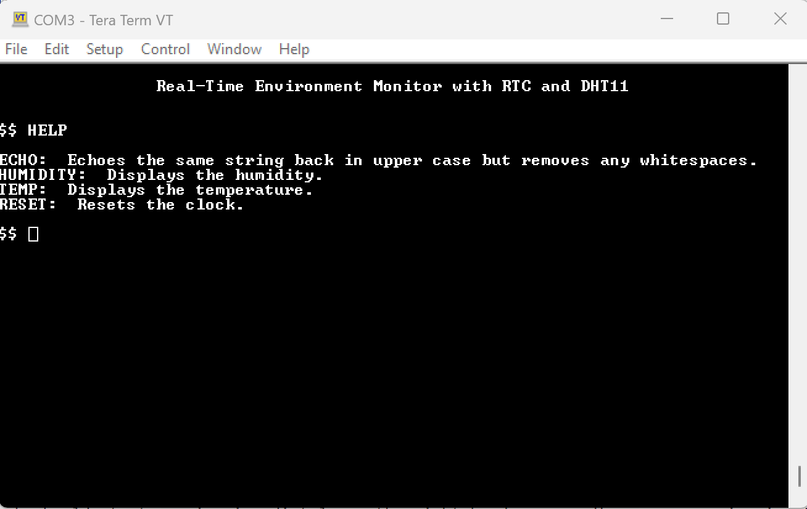
        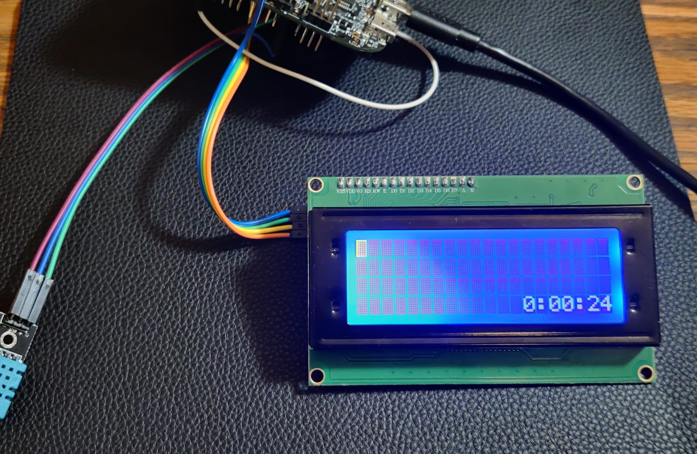

## Functionality
1. The clock will be running continuously and updating per second
        
2. User can print the humidity by typing 'humidity' on the serial terminal
        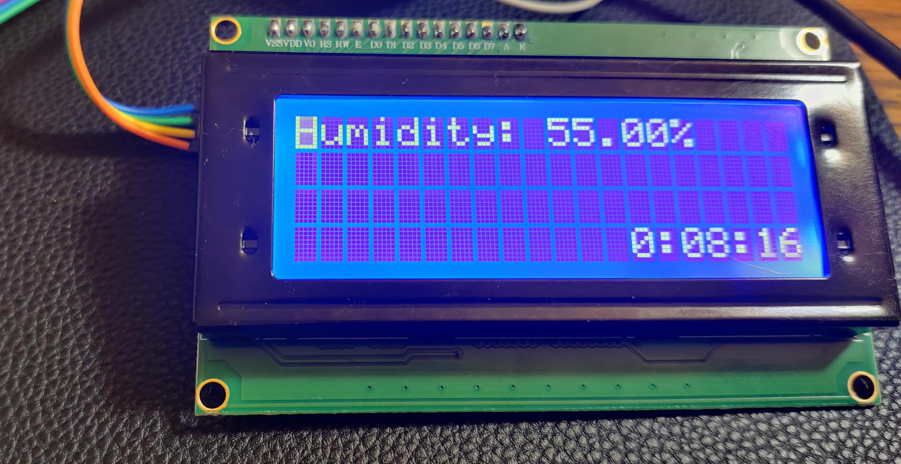
3. User can print the temperature by typing 'temp' on the serial terminal
        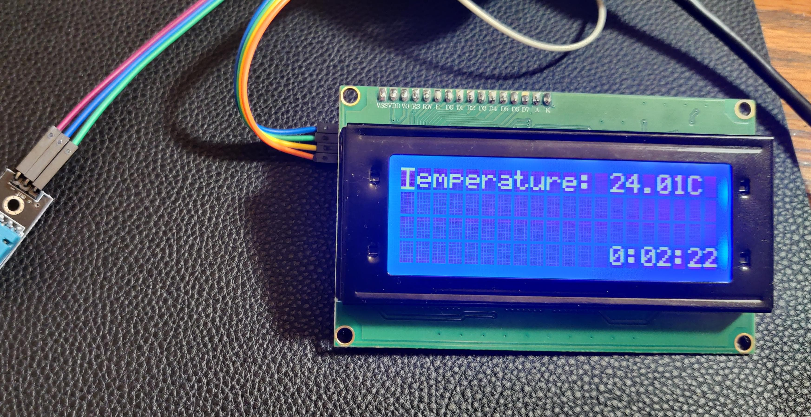
4. User can print any string on the LCD by starting the command with 'echo'
        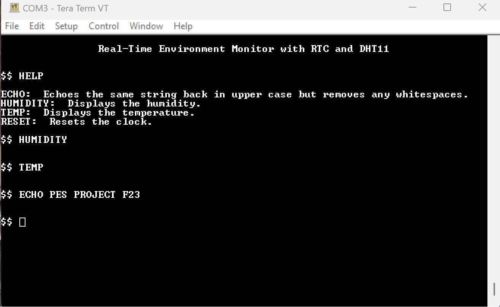
        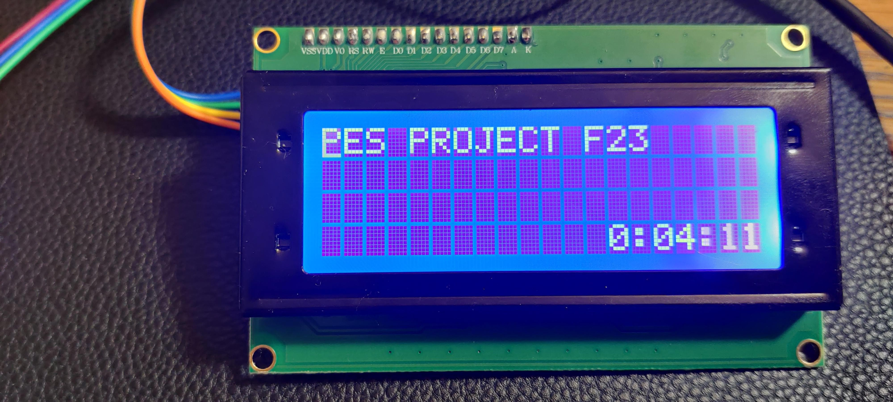
5. User can reset the clock by typing 'reset'
        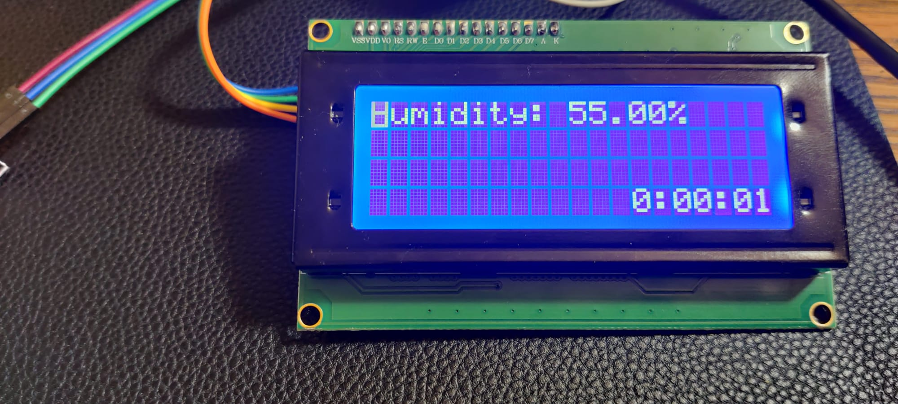

## Files
1. main.c: Main function which calls all the initialization functions and the UART terminal file with the interactive terminal session

2. UART.c: File that takes care of all UART initialization, handler and glue logic

3. cbfifo.c: File with functions and creation of the cbfifos for Tx and Rx

4. test_cbfifo.c: File to test the cbfifo

5. UART_terminal.c: File that takes care of the interactive terminal session and handling of characters received and adding it to the command buffer

6. processor.c: File that takes the character buffer and processes the commands

7. timers.c: File contains functions related to the systick timer

8. DHT11.c: File contains related to the DHT11 sensor

9. I2C.c: File contains related to the I2C bus

10. LCD.c: File contains related to the LCD

11. RTC.c: File contains related to the RTC
